## 
矩阵乘法和逆矩阵

### 概述

本节的内容主要介绍了矩阵的乘法和逆矩阵的相关概念及求解过程

### 矩阵乘法

本节课中介绍了矩阵乘法的4种求解方式

#### 常规求解方式

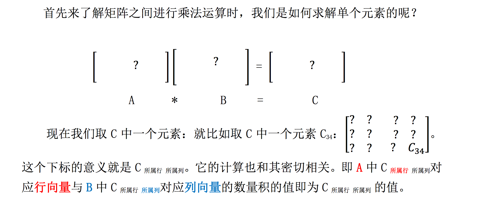

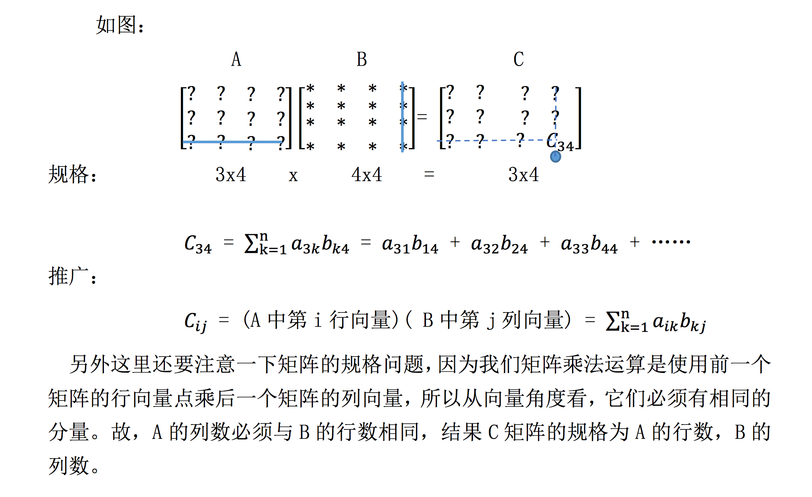

###列组合的形式

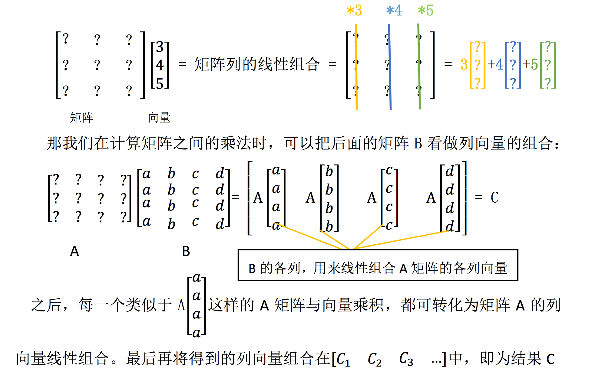

### 行组合的形式

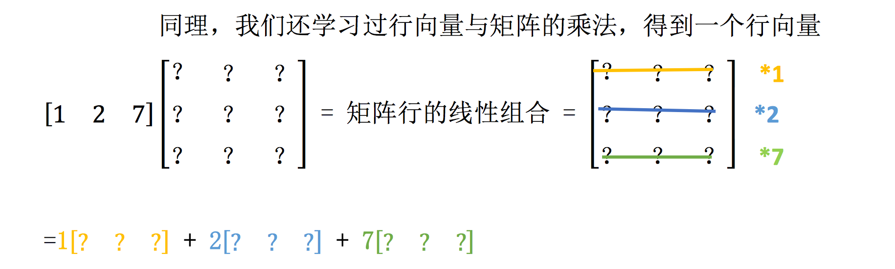

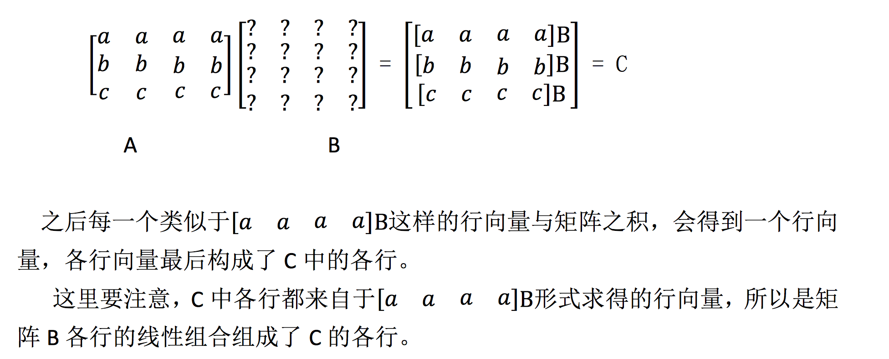

### 列乘以行

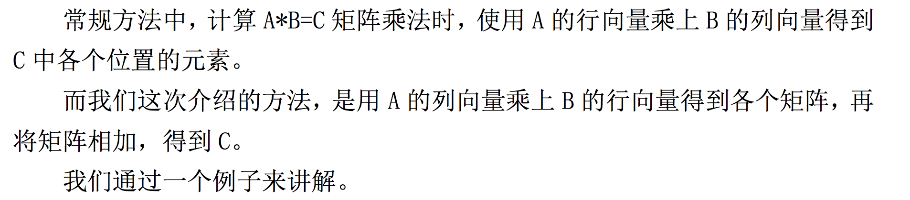

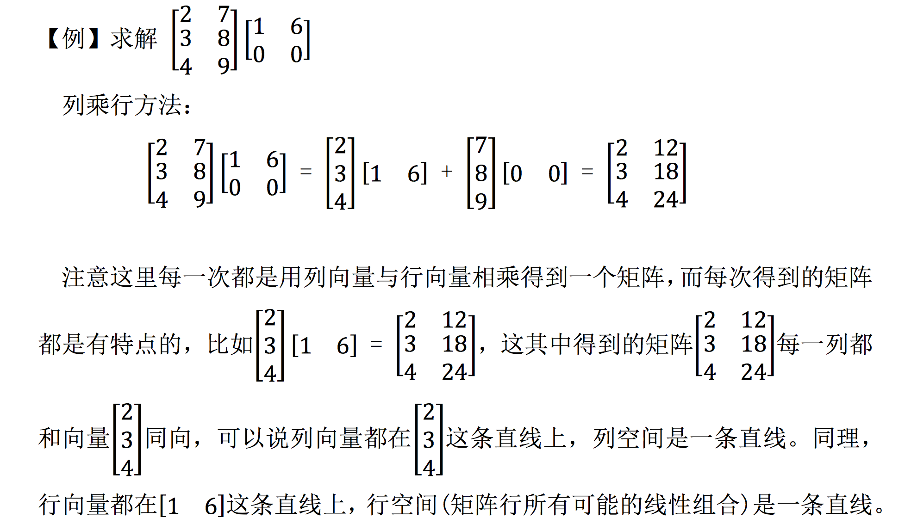

### 分块矩阵

分块乘法就是宏观上的矩阵乘法，比如现在有一个 50 * 50 的矩阵与 50 * 50 矩阵相乘，一个一个进行运算很麻烦，尤其是如果矩阵在某一区域上有一定的性质， 那么我们可以将其分块，如：

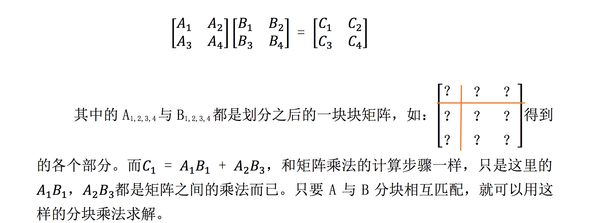

### 逆矩阵

​	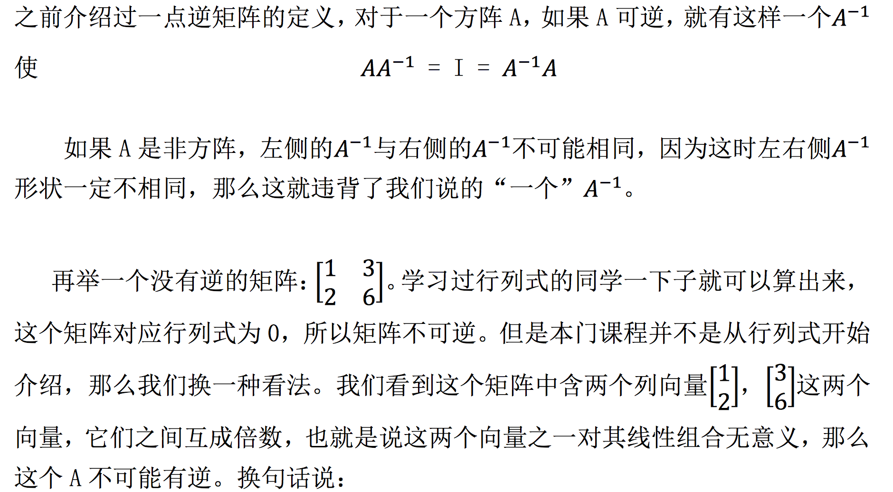

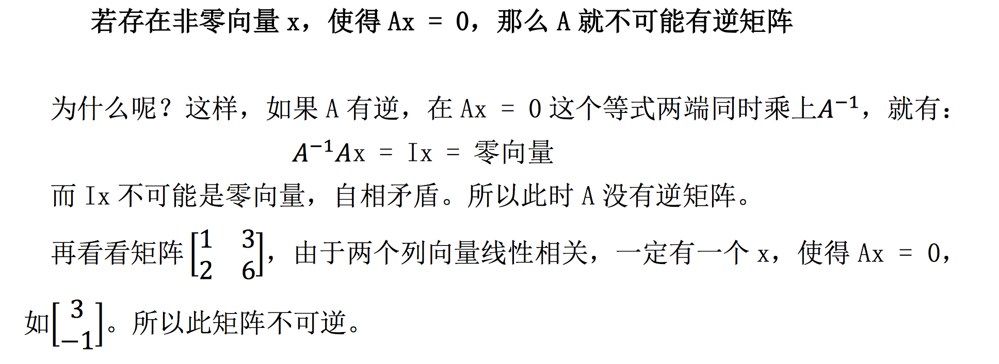

#### 逆矩阵求解

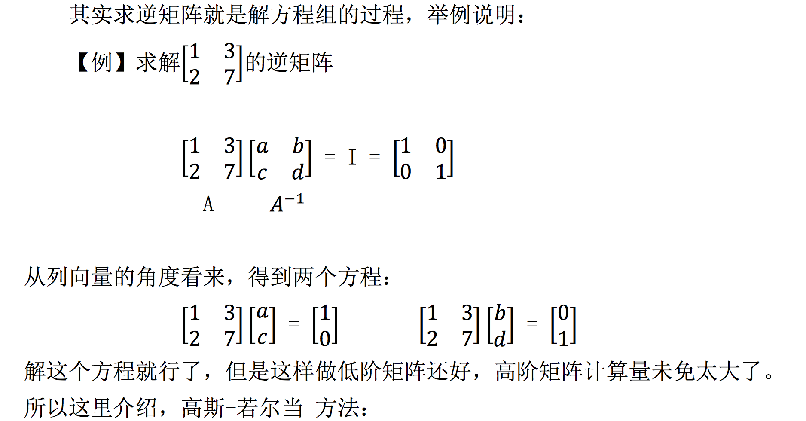

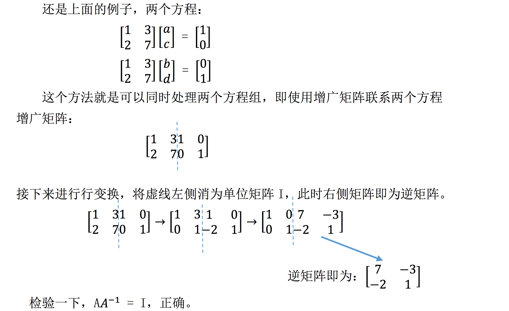

对此步骤的证明：

上述过程，对$\left[\begin{array}{cc}{1} & {3} \\ {2} & {7}\end{array}\right]$进行消元处理使它变成单位矩阵$I$，就相当于左乘一大堆消元矩阵，假设为E，则有$E\left[\begin{array}{cc}{1} & {3} \\ {2} & {7}\end{array}\right]=I$，那么E肯定就是逆矩阵$A^{-1}$,而虚线右边，单位矩阵$\left[\begin{array}{cc}{1} & {0} \\ {0} & {71}\end{array}\right]$经历了相同的消元过程，最后的结果相当于$EI=A^{-1}$，则虚线右边得到的结果则是$A^{-1}$。

### 参考

[MIT 笔记]([https://linalg.apachecn.org/#/03-%E4%B9%98%E6%B3%95%E5%92%8C%E9%80%86%E7%9F%A9%E9%98%B5/03-%E4%B9%98%E6%B3%95%E5%92%8C%E9%80%86%E7%9F%A9%E9%98%B5](https://linalg.apachecn.org/#/03-乘法和逆矩阵/03-乘法和逆矩阵))