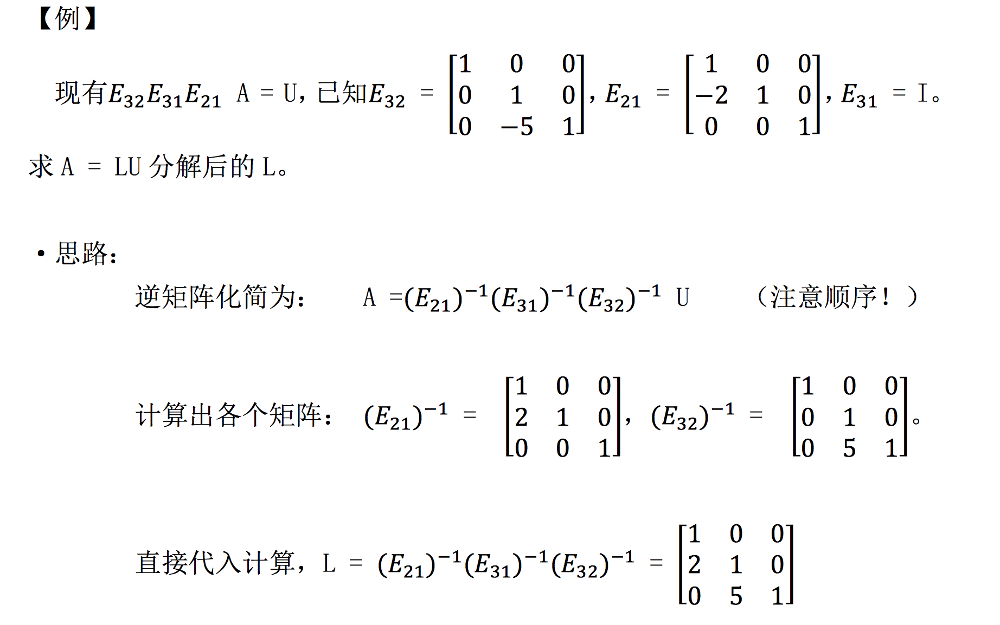
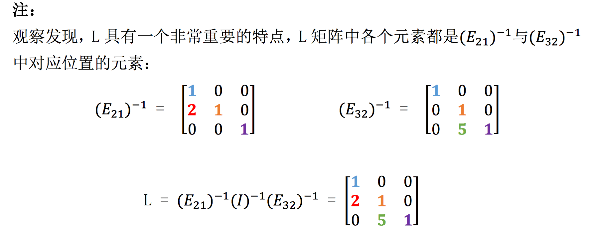
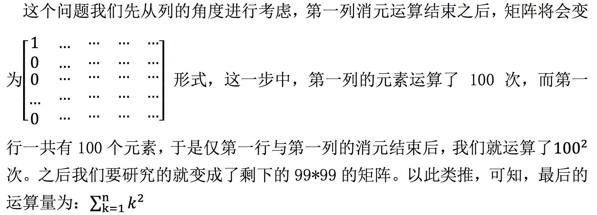

## 
矩阵的LU分解

### 概述

在本节课中首先是对逆矩阵内容的补充，然后使用消元矩阵介绍矩阵的**LU分解**，接着引入**置换矩阵(permutation matrix)**的概念。

### 逆矩阵性质

假设方阵A和B都是可逆矩阵，那么AB的逆矩阵是什么？根据逆矩阵定义可以知道有AB和逆矩阵相乘为单位阵，有$ABB^{-1}A^{-1}=I$，因此可以得出AB的逆矩阵为$B^{-1}A^{-1}$。故关于逆矩阵有如下性质：
$$
(AB)^{-1}=B^{-1}A^{-1}
$$

### 转置矩阵

矩阵A的转置记做$\mathbf{A}^\mathrm{T}$。是由下列等价动作建立：

- 把*A*的横行写为$\mathbf{A}^\mathrm{T}$的纵列
- 把*A*的纵列写为$\mathbf{A}^\mathrm{T}$的横行

### 转置矩阵与逆矩阵的关系

逆矩阵中最重要的性质则是$\mathbf{A}^\mathrm{-1}\mathbf{A}=\mathbf{I}$，为找到转置矩阵与逆矩阵的关系，对$\mathbf{A}^\mathrm{-1}\mathbf{A}=\mathbf{I}$两边同时进行转置运算。得到
$$
\left(\mathrm{A} A^{-1}\right)^{T}=\left(A^{-1}\right)^{T} A^{T}=\mathrm{I}
$$
关于转置脱括号时候为什么会交换顺序，[解释](https://math.stackexchange.com/questions/1279861/why-intuitively-is-the-order-reversed-when-taking-the-transpose-of-the-product)，姑且称为“穿脱原则”。即穿的顺序是先穿鞋再穿袜子，脱的时候先脱鞋再脱袜子。而矩阵的逆和转置都满足此原则。又$(A^{-1})^{T}A^T=I$可得，$(A^{-1})^T=(A^{-1})^T$。也就是说：**矩阵的逆和矩阵的转置两个运算可以交换运算顺序。**

### 矩阵的LU分解

矩阵的LU分解（LU Decomposition）是矩阵分解的一种，可以将一个矩阵分解为一个下三角矩阵（Lower Triangle Matrix）和一个上三角矩阵（Upper Triangle Matrix）。

在之前我们经过初等行变换将矩阵A变成了一个上三角矩阵U，即$EA=U$,那么则有$A=E^{-1}U$的形式，这一过程即称为LU过程。使用一个例子来阐述此过程：

其实从感性的角度来想，A到E的过程其实是经过一系列下三角部分的初等行变换过来的，这些操作的逆矩阵同样在下三角部分，因此可以被分解为一个下三角矩阵和一个上三角矩阵的乘积形式。

这就给了我们启示，在使用 A = LU 分解矩阵的时候，我们只需要从 U 入 手，反过来考虑，看如何通过行变换可以将上三角矩阵 U 变为 L，然后再将单位阵按此形式变化，就得到了 L 矩阵。这个性质也是 A = LU 形式分解矩阵的 最大优点，我们甚至不需要知道类似的值到底是什么，我们只需要知道变换形式， 即可求出 L，写出 A = LU 等式。

最后是估计运算量的问题，即将一个矩阵化为上三角的形式需要进行多少次运算。

过程：

### 置换矩阵

我们在之前讨论过，在进行矩阵行变换的时候主元不允许为0，若为0需要进行行变换，而在之前还以二维方阵讨论过矩阵的交换，即在矩阵左边乘一个经过单位阵经过行变换的矩阵即可。这种矩阵称为置换矩阵(permutation matrix)，记为P。这些矩阵具有的性质为：

- $P^{-1}=P$
- 任意两个矩阵相乘的结果还在这些矩阵之中。

